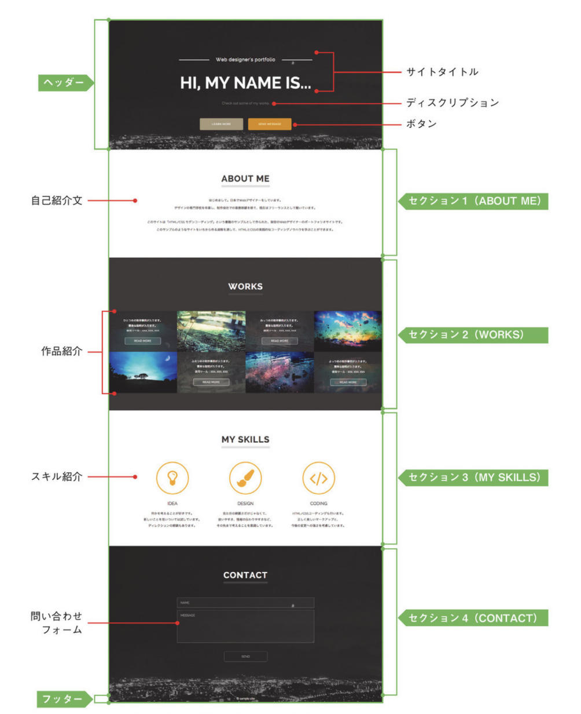

# SinglePage Layout Website Sample

## 特徴

多数の情報を包括的に掲載できる[スタンダードレイアウト](https://github.com/ryico/standard-layout-sample-website)とは対照的に、シングルページレイアウトは１つのコンテンツを前面に押し出してアピールすることに向いている。  
この特徴を活かせる例としては、特定の商品にフォーカスした特設サイトや期間限定のキャンペーンサイト、クリエイターが自分の情報をアピールするポートフォリオサイトなどがある。  
画面を広く使い視覚に訴えやすいので、押し出したい情報を目の引く形で効果的に掲載できる。  
ページ遷移がないままコンテンツを最初から最後まで一続きで見せることができ、ユーザーが離脱しづらいというメリットもあるため、広告のリンク先となり本サイトへの誘導になるようなLPにも多く使用される。  
その分全てのコンテンツを要素の１ページに詰め込むため、サイトの読み込みに時間がかかりすぎないよう画像サイズを抑えるなどの注意が必要。  
スマホやタブレットへの表示最適化が行いやすいというメリットもある。

## サイト構成

- ヘッダー
- セクション１（ABOUT ME）
- セクション２（WORKS）
- セクション３（MY SKILLS）
- セクション４（CONTACT）
- フッター



## 参照

[HTML5/CSSモダンコーディング フロントエンドエンジニアが教える３つの本格レイアウト](https://www.amazon.co.jp/gp/product/B0176GNY26/ref=ppx_yo_dt_b_d_asin_title_o03?ie=UTF8&psc=1)
